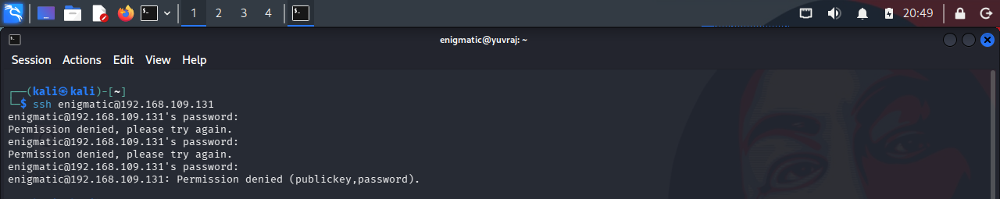
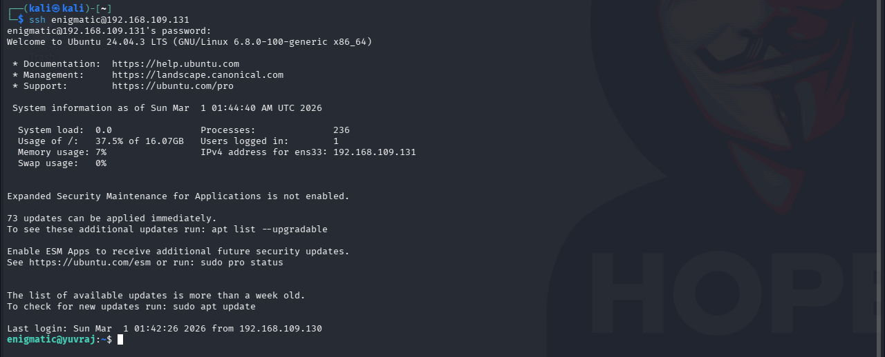
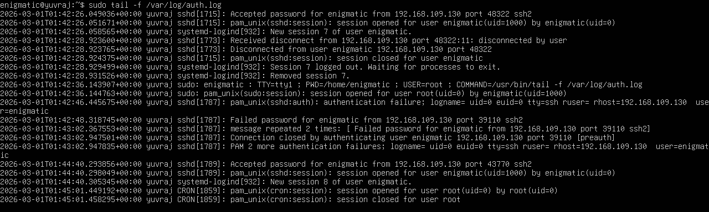

# Incident Report : SSH Authentication Monitoring & Attack Simulation


## 1. Objective 

To simulate controlled SSH Authentication failures from an attacker machine and analyze how Ubuntu Server logs both failed and successfull login attempts in  `/var/log/auth.log `.

### Goals :

- Understand log structure
- Perform timestamp correlation
- Analyze authentication patterns
- Track source IP activity
- Differentiate between failed and successful authentication events

---

## 2. Lab Environment 

### Attacker Machine
- **Operating System:** Kali Linux
- **IP Address:** 192.168.109.130

### Target Machine
- **Operating System:** Ubuntu Server 24.04 LTS  
- **IP Address:** 192.168.109.131  
- **SSH Service:** Active (Port 22)

### Monitoring Command Used (Target)

```bash
sudo tail -f /var/log/auth.log
```
This command enabled real-time monitoring of authentication-related events generated by the SSH daemon.

---

## 3. Attack Simulation Procedure

### SSH Attempt from Attacker Machine

```bash
ssh enigmatic@192.168.109.131
```
### Phase 1 - Intentional Failed Logins
Multiple incorrect passwords were intentionally enetred from the attacker machine.

#### Attacker Terminal Output:
```bash
Permission denied, please try again.
Permission denied (publickey,password).
```

Figure 1: Failed SSH login attempts from Kali machine

### Phase 2 - Successful Login
After multiple failed attempts, the correct password was entered.

#### Attacker Terminal Output:
```bash
Welcome to Ubuntu 24.04 LTS
Last login from 192.168.109.130
```

Figure 2: Successful SSH authentication after previous failed attempts

---

## 4. Log Evidence Analysis
Observed entries in  `/var/log/auth.log `:

### Failed Authentication Entry
```bash
Failed password for enigmatic from 192.168.109.130 port 39110 ssh2
```
 ### Successful Authentication Entry
 ```bash
 Accepted password for enigmatic from 192.168.109.130 port 43770 ssh2
 ```

Figure 3: Authentication events recorded in `/var/log/auth.log`

---

## 5. Log Structure Breakdown

### Example Log Entry
```bash
Mar  1 01:43:02 sshd[1787]: Failed password for enigmatic from 192.168.109.130 port 39110 ssh2
```

### Field Analysis
| Field                | Description                       |
| -------------------- | --------------------------------- |
| Mar 1 01:43:02       | Timestamp of the event            |
| sshd[1787]           | SSH daemon process and Process ID |
| Failed password      | Authentication failure indicator  |
| for enigmatic        | Target username                   |
| from 192.168.109.130 | Source IP address                 |
| port 39110           | Source ephemeral TCP port         |
| ssh2                 | SSH protocol version              |

---

## 6. Timestamp Correlation
Extracted authentication sequence:
```bash
01:43:02 – Failed password
01:43:02 – Message repeated 2 times
01:44:40 – Accepted password
```

### Observation
- Multiple failures occurred within a short time interval.

- Successful authentication followed shortly after.

- The time spacing suggests manual login attempts rather than high-speed automated brute force.

- No account lockout or rate limiting mechanism was triggered.

---

## 7. Pattern Analysis
### Observed Behavior
- Same source IP address across attempts

- Same target username

- Increasing source ports (normal TCP client behavior)

- Multiple failed attempts followed by success

### Security Interpretation
This behavior resembles early-stage brute-force or password guessing activity.

If automated and scaled:

- It could result in credential compromise.

- It could trigger detection systems (if configured).

- It may indicate reconnaissance behavior before privilege escalation.

---

## 8. Security Gaps Identified
The current system does not implement:

- Automated IP blocking (e.g., Fail2Ban)

- Login attempt rate limiting

- SSH key-only authentication enforcement

- Intrusion detection or alerting mechanisms

These represent potential hardening improvements.

---

## 10. Conclusion
The controlled SSH authentication simulation successfully demonstrated:

- Accurate log generation

- Event traceability

- Timestamp-based behavioral analysis

- Authentication pattern recognition

This lab strengthens foundational skills required for:

- SOC analysis

- Incident response

- Log correlation

- Threat detection